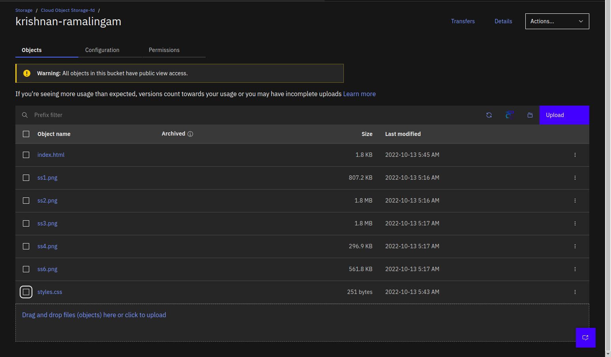
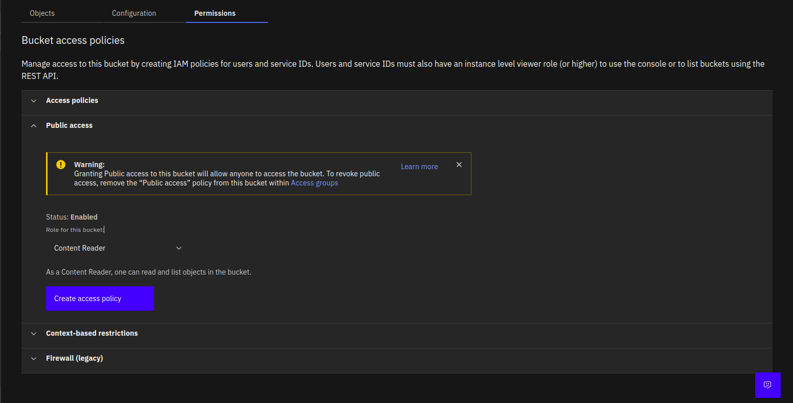

    
    [Link for Object Site](https://s3.jp-tok.cloud-object-storage.appdomain.cloud/krishnan-ramalingam/index.html)

<figure>

<figcaption align = "center"><b>Fig.1 - 4K Mountains Wallpaper</b></figcaption>
</figure>

### Object Store Assignment

<table>
	<thead>
		<td>
			<b>Uploaded Objects</b>
		</td>
		<td>
			<b>Access Controls</b>
		</td>
	</thead>
	<tr>
		<td>
            
		</td>
		<td>
            
		</td>
	</tr>
</table>

#
